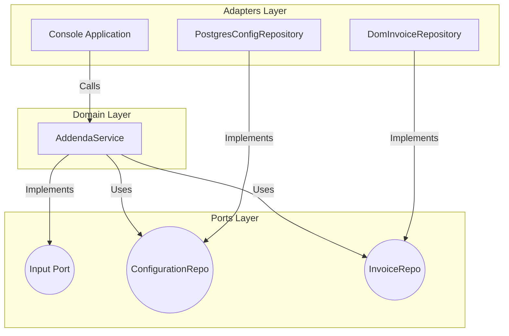
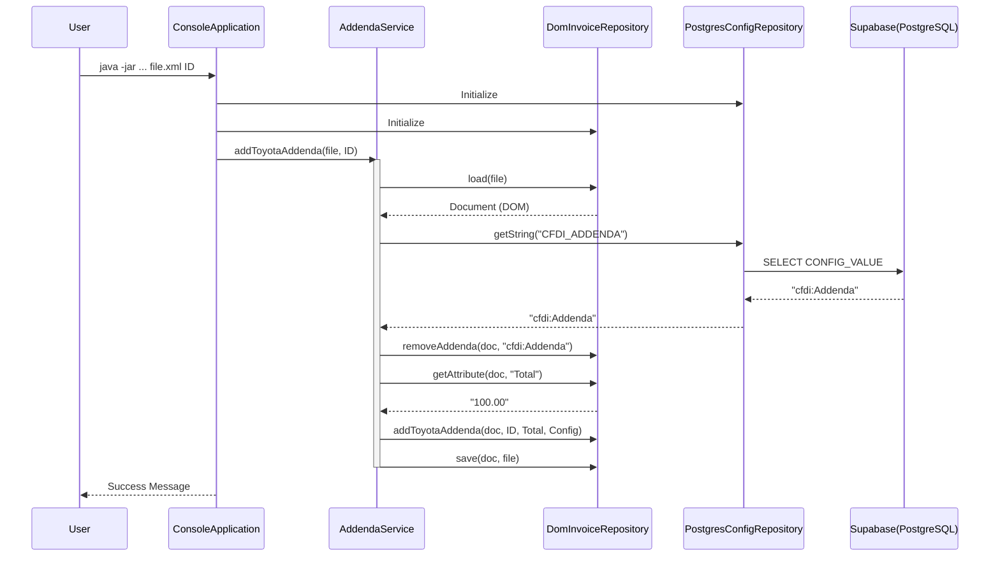
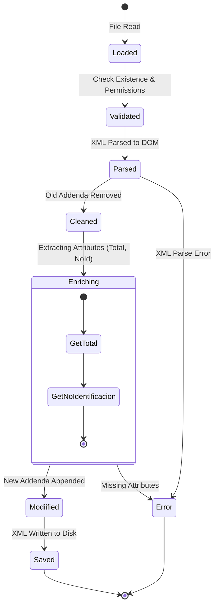

# Architecture Documentation

## 1. Hexagonal Architecture (Ports & Adapters)

This diagram shows how the application is structured. The **Domain** (core logic) is isolated from the **Infrastructure** (adapters) via **Ports** (interfaces).

## 2. Sequence Diagram (Execution Flow)

This diagram illustrates the flow of control when the application runs.

## 3. State Diagram (Invoice Processing)

This diagram represents the states a specific XML Invoice goes through during the process.

